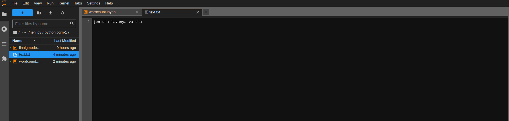

# Word-count
## AIM:
To write a python program for getting the word count from a text.
## EQUIPEMENT'S REQUIRED: 
PC
Anaconda - Python 3.7
## ALGORITHM: 
### Step 1:
Initially assign num_words = 0.
### Step 2: 
Open an existing text file using with open().
### Step 3: 
Use for loop and split().
### Step 4:  
Use num_words += len(word) to calculate the word count.
### Step 5: 
Give the print statements outside the loop.
### Step 6: 
End the program.
## PROGRAM:
```python
# Reference No: 22002972
# Developed By: JENISHA.J

num_words=0
with open('text.txt','r') as f:
    for i in f:
        word=i.split()
        num_words+=len(word)
print("Number of words in the file = {}".format(num_words))
```
## OUTPUT:
### wordcount.ipynb file

<br>

### text.txt file

<br>

## RESULT:
Thus the program is written to find the word count from a text.
